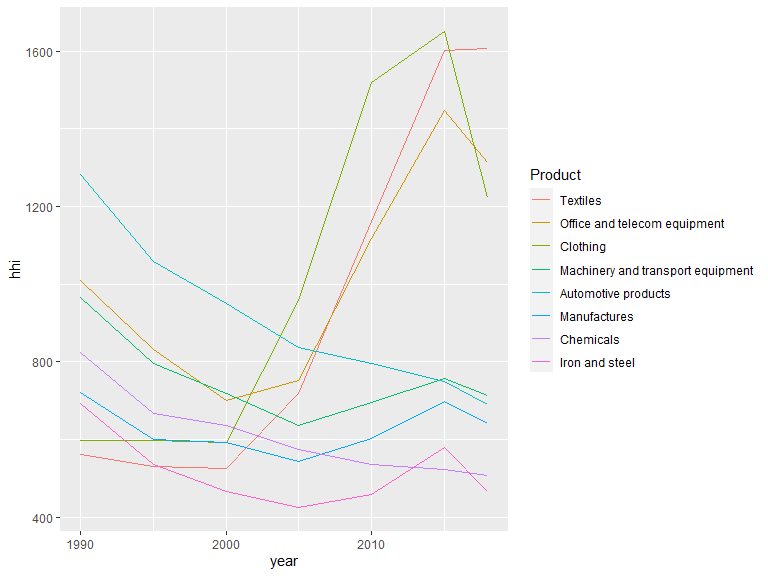
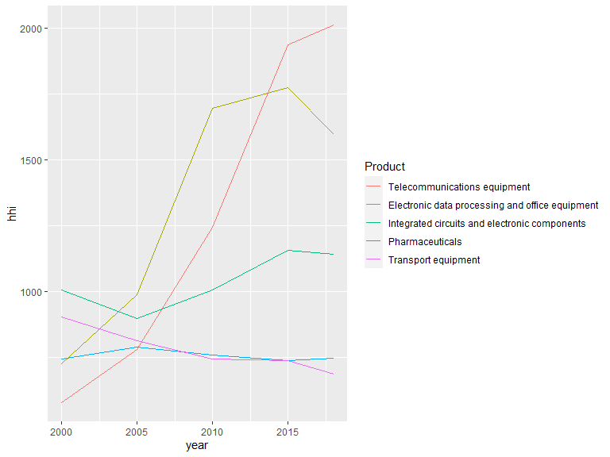
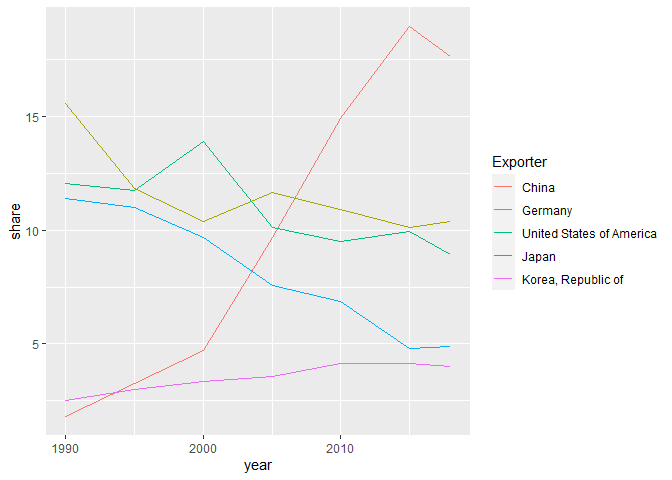

Herfindahl-Hirschman Index of world export by product
================
Mitsuo Shiota
2020/5/11

  - [Motivation](#motivation)
  - [Download export value data by area and product
    group](#download-export-value-data-by-area-and-product-group)
  - [Read csv file](#read-csv-file)
  - [Check sum](#check-sum)
  - [Calculate Herfindahl-Hirschman
    Index](#calculate-herfindahl-hirschman-index)
  - [Draw charts of HHI by product](#draw-charts-of-hhi-by-product)
  - [Draw charts of shares of main exporters in
    “Manufactures”](#draw-charts-of-shares-of-main-exporters-in-manufactures)

Updated: 2020-05-11

## Motivation

I was asked to calculate something like Herfindahl-Hirschman Index,
which shows how the production of a certain goods concentrates in a few
areas, and to confirm the global supply chains have become fragile due
to rising concentration of production.

I didn’t know what Herfindahl-Hirschman Index is, so searched by google,
and got [this page](https://www.investopedia.com/terms/h/hhi.asp), which
says it is a commonly accepted measure of concentration. In my case, I
have to calculate the share of each area, square, and sum up for each
product. If one area produces 100 percent, then HHI is 10000, which is
maximum.

## Download export value data by area and product group

I could not find production data , but could find export value data in
[WTO Data](https://timeseries.wto.org/). If export is concentrated in
some area, probably production is also concentrated in that area.

From the left side column in [WTO Data](https://timeseries.wto.org/), in
“Indicators” I chose “International trade statistics” \> “Merchandise
trade values” \> “Merchandise trade exports by product group and
destination - annual (Million US Dollars), all top selections.
In”Reporting Economies" I chose “world” and all “individual economies”
by using “Filter”. In “Products / Sectors” I chose “Manufacturers”
including sub-items. In “Partner Economies” I chose “world”. In “Year” I
chose every 5 year from 1990 and most recent 2018. Then I pushed “Apply”
button, and finally downloaded a csv file.

## Read csv file

I read the downloaded csv file, and drop irrelevant columns.

``` r
data_raw <- read_csv("data/WtoData_20200510015454.csv")
```

    ## Parsed with column specification:
    ## cols(
    ##   .default = col_character(),
    ##   `Partner Economy ISO3A Code` = col_logical(),
    ##   Year = col_double(),
    ##   `Text Value` = col_logical(),
    ##   Value = col_double()
    ## )

    ## See spec(...) for full column specifications.

``` r
wto_export <- data_raw %>% 
  select(`Reporting Economy`, `Product/Sector`, Year, Value)

names(wto_export) <- c("exporter", "product", "year", "value")
```

## Check sum

Considering German reunification in 1990 and Hong Kong return to China
in 1997, I remove double counts in individual economies. However, there
remain more than 5 percent differences in some years in “Clothing” and
“Textiles”. I decide to ignore the differences.

``` r
exports <- wto_export %>% 
  filter(exporter != "World") %>% 
  # remove double count
  filter(!(exporter %in% 
             c(
               "German Democratic Republic",
               "Germany, Federal Republic of",
               "Ethiopia (+ Eritrea)"
             )
  )) %>% 
  # Hong Kong returned to China in 1997
  filter(!(exporter == "Hong Kong, China" & year >= 2000))

world <- wto_export %>% 
  filter(exporter == "World") %>% 
  select(-exporter)

total <- exports %>% 
  group_by(product, year) %>% 
  summarize(total = sum(value))

large_diff <- total %>% 
  left_join(world, by = c("product", "year")) %>% 
  mutate(
    diff = value - total,
    diff_percent = diff / value * 100
    ) %>% 
  filter(abs(diff_percent) > 5)

large_diff
```

    ## # A tibble: 3 x 6
    ## # Groups:   product [2]
    ##   product   year   total   value    diff diff_percent
    ##   <chr>    <dbl>   <dbl>   <dbl>   <dbl>        <dbl>
    ## 1 Clothing  2000 185165. 197723.  12558.         6.35
    ## 2 Textiles  1990 110180. 104354   -5826.        -5.58
    ## 3 Textiles  1995 163324. 152319  -11005.        -7.22

## Calculate Herfindahl-Hirschman Index

I calculate shares by using the total of individual economies as a
denominator, square them, and sum up by product to get HHI.

``` r
exports2 <- exports %>% 
  left_join(total, by = c("product", "year")) %>% 
  mutate(
    share = value / total * 100,
    share_sq = share^2)

export_hhi <- exports2 %>% 
  group_by(product, year) %>% 
  summarize(
    hhi = sum(share_sq)
  ) %>% 
  left_join(world, by = c("product", "year")) %>% 
  drop_na(value) %>% 
  select(-value)
```

## Draw charts of HHI by product

“Manufactures” are the total of manufactured goods. Its HHI declined up
to 2005, climbed to 2015, and dipped a bit in 2018, probably due to the
movement of Chinese shares.

``` r
class1 <- export_hhi %>% 
  filter(year == 1990)

class1_product <- unique(class1$product)

class2_product <- setdiff(unique(export_hhi$product), class1_product)

export_hhi %>% 
  filter(product %in% class1_product) %>% 
  ggplot(aes(year, hhi, color = fct_reorder2(product, year, hhi))) +
  geom_line() +
  labs(color = "Product")
```

<!-- -->

“Textiles”, “Office and telecom equipment” and “Clothing” have
especially high HHI. Who are they? You can see Chinese dominance
contribute to high HHI below. Note that “value” is in million US
dollars, and “share” is in percent.

``` r
exports2 %>% 
  filter(product == "Textiles", year == 2018) %>% 
  arrange(desc(share))
```

    ## # A tibble: 168 x 7
    ##    exporter                 product   year   value   total share share_sq
    ##    <chr>                    <chr>    <dbl>   <dbl>   <dbl> <dbl>    <dbl>
    ##  1 China                    Textiles  2018 118526. 312541. 37.9   1438.  
    ##  2 India                    Textiles  2018  18115. 312541.  5.80    33.6 
    ##  3 Germany                  Textiles  2018  14791. 312541.  4.73    22.4 
    ##  4 United States of America Textiles  2018  13822. 312541.  4.42    19.6 
    ##  5 Italy                    Textiles  2018  12724. 312541.  4.07    16.6 
    ##  6 Turkey                   Textiles  2018  11874. 312541.  3.80    14.4 
    ##  7 Korea, Republic of       Textiles  2018   9814. 312541.  3.14     9.86
    ##  8 Chinese Taipei           Textiles  2018   9227. 312541.  2.95     8.72
    ##  9 Viet Nam                 Textiles  2018   8129. 312541.  2.60     6.76
    ## 10 Pakistan                 Textiles  2018   8004. 312541.  2.56     6.56
    ## # ... with 158 more rows

``` r
exports2 %>% 
  filter(product == "Office and telecom equipment", year == 2018) %>% 
  arrange(desc(share))
```

    ## # A tibble: 165 x 7
    ##    exporter            product                year  value   total share share_sq
    ##    <chr>               <chr>                 <dbl>  <dbl>   <dbl> <dbl>    <dbl>
    ##  1 China               Office and telecom e~  2018 6.50e5  2.06e6 31.6     999. 
    ##  2 Korea, Republic of  Office and telecom e~  2018 1.70e5  2.06e6  8.26     68.3
    ##  3 United States of A~ Office and telecom e~  2018 1.52e5  2.06e6  7.38     54.4
    ##  4 Chinese Taipei      Office and telecom e~  2018 1.31e5  2.06e6  6.38     40.7
    ##  5 Singapore           Office and telecom e~  2018 1.23e5  2.06e6  5.97     35.6
    ##  6 Netherlands         Office and telecom e~  2018 1.12e5  2.06e6  5.46     29.8
    ##  7 Malaysia            Office and telecom e~  2018 8.39e4  2.06e6  4.08     16.6
    ##  8 Viet Nam            Office and telecom e~  2018 8.21e4  2.06e6  3.99     16.0
    ##  9 Germany             Office and telecom e~  2018 7.88e4  2.06e6  3.83     14.7
    ## 10 Mexico              Office and telecom e~  2018 6.99e4  2.06e6  3.40     11.6
    ## # ... with 155 more rows

``` r
exports2 %>% 
  filter(product == "Clothing", year == 2018) %>% 
  arrange(desc(share))
```

    ## # A tibble: 169 x 7
    ##    exporter    product   year   value   total share share_sq
    ##    <chr>       <chr>    <dbl>   <dbl>   <dbl> <dbl>    <dbl>
    ##  1 China       Clothing  2018 157848. 493965. 32.0   1021.  
    ##  2 Bangladesh  Clothing  2018  32927. 493965.  6.67    44.4 
    ##  3 Viet Nam    Clothing  2018  28375. 493965.  5.74    33.0 
    ##  4 Italy       Clothing  2018  25356. 493965.  5.13    26.3 
    ##  5 Germany     Clothing  2018  24062. 493965.  4.87    23.7 
    ##  6 India       Clothing  2018  16552. 493965.  3.35    11.2 
    ##  7 Turkey      Clothing  2018  15645. 493965.  3.17    10.0 
    ##  8 Spain       Clothing  2018  15182. 493965.  3.07     9.45
    ##  9 France      Clothing  2018  13227. 493965.  2.68     7.17
    ## 10 Netherlands Clothing  2018  13034. 493965.  2.64     6.96
    ## # ... with 159 more rows

“Telecommunications equipment”, “Electronic data processing and office
equipment” and “Integrated circuits and electronic components” are parts
of “Office and telecom equipment” above. “Pharmaceuticals” is a part of
“Chemicals” above.

``` r
export_hhi %>% 
  filter(product %in% class2_product) %>% 
  ggplot(aes(year, hhi, color = fct_reorder2(product, year, hhi))) +
  geom_line() +
  labs(color = "Product")
```

<!-- -->

I guess “Telecommunications equipment” are mainly smart phones, and
“Electronic data processing and office equipment” are mainly note PC.
High share scorers in 2018 are:

``` r
exports2 %>% 
  filter(product == "Telecommunications equipment", year == 2018) %>% 
  arrange(desc(share))
```

    ## # A tibble: 163 x 7
    ##    exporter            product                year   value  total share share_sq
    ##    <chr>               <chr>                 <dbl>   <dbl>  <dbl> <dbl>    <dbl>
    ##  1 China               Telecommunications e~  2018 316682. 7.49e5 42.3   1788.  
    ##  2 Viet Nam            Telecommunications e~  2018  62986. 7.49e5  8.41    70.7 
    ##  3 Netherlands         Telecommunications e~  2018  49079. 7.49e5  6.55    43.0 
    ##  4 United States of A~ Telecommunications e~  2018  44981. 7.49e5  6.01    36.1 
    ##  5 Mexico              Telecommunications e~  2018  35772. 7.49e5  4.78    22.8 
    ##  6 United Arab Emirat~ Telecommunications e~  2018  26254. 7.49e5  3.51    12.3 
    ##  7 Germany             Telecommunications e~  2018  26032. 7.49e5  3.48    12.1 
    ##  8 Chinese Taipei      Telecommunications e~  2018  15177. 7.49e5  2.03     4.11
    ##  9 Singapore           Telecommunications e~  2018  13963. 7.49e5  1.86     3.48
    ## 10 Czech Republic      Telecommunications e~  2018  13435. 7.49e5  1.79     3.22
    ## # ... with 153 more rows

``` r
exports2 %>% 
  filter(product == "Electronic data processing and office equipment", year == 2018) %>% 
  arrange(desc(share))
```

    ## # A tibble: 162 x 7
    ##    exporter         product                    year  value  total share share_sq
    ##    <chr>            <chr>                     <dbl>  <dbl>  <dbl> <dbl>    <dbl>
    ##  1 China            Electronic data processi~  2018 2.19e5 6.05e5 36.2   1314.  
    ##  2 United States o~ Electronic data processi~  2018 5.58e4 6.05e5  9.23    85.1 
    ##  3 Netherlands      Electronic data processi~  2018 4.53e4 6.05e5  7.49    56.1 
    ##  4 Korea, Republic~ Electronic data processi~  2018 3.35e4 6.05e5  5.53    30.6 
    ##  5 Mexico           Electronic data processi~  2018 3.13e4 6.05e5  5.18    26.8 
    ##  6 Germany          Electronic data processi~  2018 2.89e4 6.05e5  4.78    22.9 
    ##  7 Thailand         Electronic data processi~  2018 2.05e4 6.05e5  3.39    11.5 
    ##  8 Singapore        Electronic data processi~  2018 1.82e4 6.05e5  3.01     9.05
    ##  9 Japan            Electronic data processi~  2018 1.76e4 6.05e5  2.91     8.46
    ## 10 Malaysia         Electronic data processi~  2018 1.69e4 6.05e5  2.79     7.78
    ## # ... with 152 more rows

``` r
exports2 %>% 
  filter(product == "Integrated circuits and electronic components", year == 2018) %>% 
  arrange(desc(share))
```

    ## # A tibble: 160 x 7
    ##    exporter         product                    year  value  total share share_sq
    ##    <chr>            <chr>                     <dbl>  <dbl>  <dbl> <dbl>    <dbl>
    ##  1 Korea, Republic~ Integrated circuits and ~  2018 1.25e5 7.03e5 17.8    316.  
    ##  2 China            Integrated circuits and ~  2018 1.14e5 7.03e5 16.2    264.  
    ##  3 Chinese Taipei   Integrated circuits and ~  2018 1.02e5 7.03e5 14.5    211.  
    ##  4 Singapore        Integrated circuits and ~  2018 9.06e4 7.03e5 12.9    166.  
    ##  5 Malaysia         Integrated circuits and ~  2018 5.83e4 7.03e5  8.30    68.9 
    ##  6 United States o~ Integrated circuits and ~  2018 5.09e4 7.03e5  7.24    52.5 
    ##  7 Japan            Integrated circuits and ~  2018 4.00e4 7.03e5  5.69    32.4 
    ##  8 Germany          Integrated circuits and ~  2018 2.38e4 7.03e5  3.39    11.5 
    ##  9 Netherlands      Integrated circuits and ~  2018 1.78e4 7.03e5  2.53     6.42
    ## 10 Philippines      Integrated circuits and ~  2018 1.67e4 7.03e5  2.38     5.65
    ## # ... with 150 more rows

``` r
exports2 %>% 
  filter(product == "Pharmaceuticals", year == 2018) %>% 
  arrange(desc(share))
```

    ## # A tibble: 162 x 7
    ##    exporter                 product          year  value   total share share_sq
    ##    <chr>                    <chr>           <dbl>  <dbl>   <dbl> <dbl>    <dbl>
    ##  1 Germany                  Pharmaceuticals  2018 97531. 636249. 15.3    235.  
    ##  2 Switzerland              Pharmaceuticals  2018 76868. 636249. 12.1    146.  
    ##  3 Ireland                  Pharmaceuticals  2018 54562. 636249.  8.58    73.5 
    ##  4 Belgium                  Pharmaceuticals  2018 50631. 636249.  7.96    63.3 
    ##  5 United States of America Pharmaceuticals  2018 50563. 636249.  7.95    63.2 
    ##  6 Netherlands              Pharmaceuticals  2018 45790. 636249.  7.20    51.8 
    ##  7 France                   Pharmaceuticals  2018 34768. 636249.  5.46    29.9 
    ##  8 United Kingdom           Pharmaceuticals  2018 31413. 636249.  4.94    24.4 
    ##  9 Italy                    Pharmaceuticals  2018 29373. 636249.  4.62    21.3 
    ## 10 China                    Pharmaceuticals  2018 17432. 636249.  2.74     7.51
    ## # ... with 152 more rows

``` r
exports2 %>% 
  filter(product == "Transport equipment", year == 2018) %>% 
  arrange(desc(share))
```

    ## # A tibble: 165 x 7
    ##    exporter               product             year  value   total share share_sq
    ##    <chr>                  <chr>              <dbl>  <dbl>   <dbl> <dbl>    <dbl>
    ##  1 Germany                Transport equipme~  2018 3.62e5  2.25e6 16.1     258. 
    ##  2 United States of Amer~ Transport equipme~  2018 2.83e5  2.25e6 12.5     157. 
    ##  3 Japan                  Transport equipme~  2018 1.95e5  2.25e6  8.65     74.9
    ##  4 Mexico                 Transport equipme~  2018 1.35e5  2.25e6  5.98     35.8
    ##  5 China                  Transport equipme~  2018 1.33e5  2.25e6  5.92     35.1
    ##  6 France                 Transport equipme~  2018 1.23e5  2.25e6  5.44     29.6
    ##  7 Korea, Republic of     Transport equipme~  2018 9.04e4  2.25e6  4.01     16.1
    ##  8 United Kingdom         Transport equipme~  2018 8.56e4  2.25e6  3.80     14.4
    ##  9 Spain                  Transport equipme~  2018 7.41e4  2.25e6  3.29     10.8
    ## 10 Canada                 Transport equipme~  2018 7.39e4  2.25e6  3.28     10.8
    ## # ... with 155 more rows

## Draw charts of shares of main exporters in “Manufactures”

I think Chinese relentless rise in export share in “Manufactures” is the
main reason of down and up of HHI. Chinese rise first contributed to HHI
decrease upto 2005 when Germany, the United States and China equally
share the exports. After that, Chinese rise contributed to HHI increase,
as it became dominant.

Chinese rise is partially driven by international division of labor by
process. For example, smart phones are assembled in China and exported
to the world from China, but their main parts are imported from South
Korea, Taiwan, Japan, and others to China. International division of
labor by process leads to faster growth of intermediate goods trade than
final goods trade, which is shown in 2019 METI international trade white
book
[(Japanese)](https://www.meti.go.jp/report/tsuhaku2019/2019honbun/i2110000.html).

``` r
exports2 %>% 
  filter(product == "Manufactures") %>% 
  filter(exporter %in% c("United States of America", "China",
                         "Germany", "Japan", 
                         "Korea, Republic of")) %>% 
  ggplot(aes(year, share, color = fct_reorder2(exporter, year, share))) +
  geom_line() +
  labs(color = "Exporter")
```

<!-- -->

EOL
